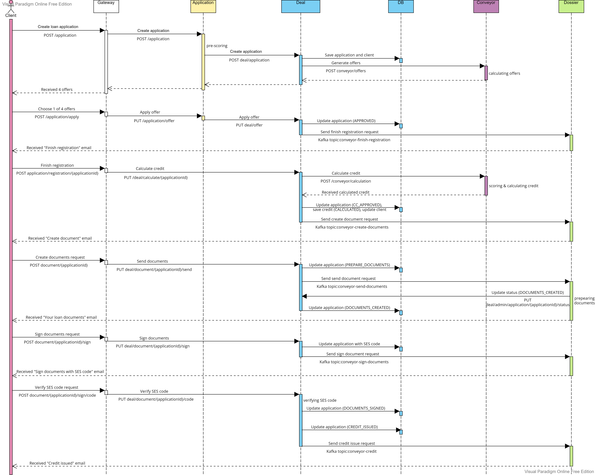

# Bank Spring Boot Microservices Application


## Overview

The **Bank Spring Boot Microservices Application** is a modern, scalable, and efficient banking system built using a microservices architecture. It is designed to provide a robust and flexible banking platform that can adapt to evolving customer needs and industry requirements. 


## Key Features

- **Microservices Architecture**: The application is structured as a collection of loosely coupled microservices, each responsible for specific banking functions such as account management, transactions, customer authentication, and more.

- **Highly Scalable**: As a microservices-based architecture, it can scale each service independently to meet varying demand. This ensures optimal resource utilization and high performance under load.

- **Containerization**: Docker containers are used to package each microservice, making it easy to deploy and manage in various environments. 

- **API-First Approach**: The application follows an API-first design philosophy, allowing for easy integration with third-party services and mobile applications. It provides a clear and well-documented API for developers to work with.

- **Database Integration**: Utilizes a range of databases, including relational and NoSQL, depending on the specific requirements of each microservice.

## Technology Stack

- **Java**: Primary programming language is Java, a widely adopted and platform-independent language known for its performance and extensive ecosystem. Java forms the backbone of our application logic.

- **Spring Boot**: We harness the power of Spring Boot, a popular Java framework, to simplify the development of production-ready applications. 

- **PostgreSQL**: PostgreSQL serves as our relational database management system (RDBMS). 

- **Swagger**: Swagger is employed for API documentation. 

- **Kafka**: Apache Kafka acts as our event streaming platform. 

- **JUnit**: JUnit is our testing framework of choice. 

- **Lombok**: Lombok is used to reduce boilerplate code and enhance code readability. 

- **Docker**: Docker containers are used for packaging and deploying our microservices. 

## Endpoints

### Application Controller

- **Get Loan Offers**
   - **Endpoint:** `POST /application/`
   - **Description:** Retrieve a list of 4 possible loan offers.
   - **Usage:** Send a POST request with a valid `LoanApplicationRequestDTO` in the request body.

- **Apply for a Loan**
   - **Endpoint:** `PUT /application/apply`
   - **Description:** Apply for one of the loan offers.
   - **Usage:** Send a PUT request with a valid `LoanOfferDTO` in the request body.

### Document Controller

- **Calculate Credit by Application Id**
   - **Endpoint:** `POST /application/registration/{applicationId}`
   - **Description:** Complete registration and calculate credit details.
   - **Usage:** Send a POST request with a valid `FinishRegistrationRequestDTO` in the request body.

- **Request to Send Documents**
   - **Endpoint:** `POST /{applicationId}/send`
   - **Description:** Request to send documents.
   - **Usage:** Send a POST request to initiate the document sending process.

- **Request to Sign Documents**
   - **Endpoint:** `POST /{applicationId}/sign`
   - **Description:** Request to sign documents.
   - **Usage:** Send a POST request to initiate the document signing process.

- **Sign Documents by Code**
   - **Endpoint:** `POST /{applicationId}/code`
   - **Description:** Sign documents using a code.
   - **Usage:** Send a POST request with a valid session code to sign documents.

### Admin Controller

- **Get Application by ID**
   - **Endpoint:** `GET /admin/application/{applicationId}`
   - **Description:** Retrieve an application by its ID.
   - **Usage:** Send a GET request with the `applicationId` as a query parameter.

- **Get All Applications**
   - **Endpoint:** `GET /admin/application`
   - **Description:** Retrieve a list of all applications.
   - **Usage:** Send a GET request to retrieve a list of all applications.

### Running the Application

1. Clone this repository to your local machine:

   ```shell
   git clone https://github.com/vlad777442/spring-boot-credit-system.git
    ```
2. Run Docker on your local machine, and run the following command in the terminal:  
    ```shell
   docker-compose up --build
   ```
3. To access the Swagger documentation, (http://localhost:8390/swagger-ui/index.html#/).

### Sequence diagram



## License

This project is licensed under the MIT License. See the [LICENSE](LICENSE) file for details.
